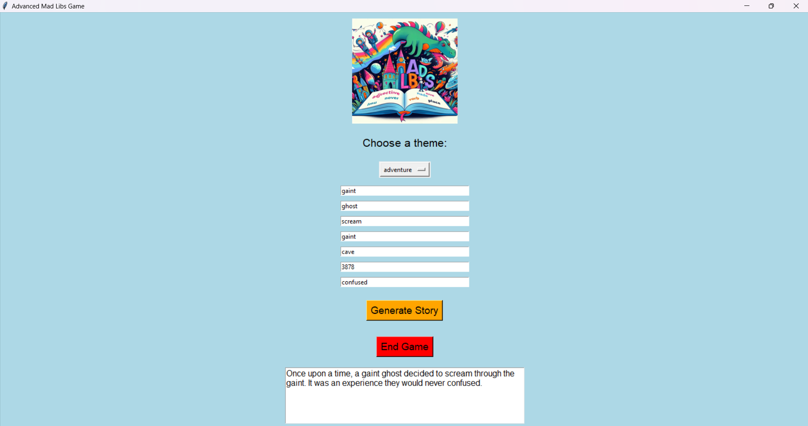

```markdown
# 🏰 Advanced Mad Libs Game

Welcome to the **Advanced Mad Libs Game**, a fun and interactive storytelling application built using Python and Tkinter! Dive into a world of creativity where you can generate unique stories based on your inputs or let the game surprise you with random words.

---

## 🌟 Description

The Advanced Mad Libs Game allows users to create entertaining stories by filling in the blanks with various parts of speech. Choose from multiple themes such as Adventure, Sci-Fi, or Horror, and let your imagination run wild!

---

## 🔧 Features

- **Interactive GUI**: A user-friendly interface built with Tkinter.
- **Dynamic Themes**: Choose from different story templates.
- **Random Suggestions**: Get random words if you don't have your own!
- **Story Animation**: Watch your story unfold character by character for added excitement.
- **Image Display**: A whimsical image to enhance the storytelling experience.
- **End Game Option**: A button to exit the application gracefully.

---

## 📦 Installation

To run this project, you need to have Python installed on your machine along with the following libraries:

1. **Pillow** (for image handling)
2. **Tkinter** (comes with Python installations)

You can install Pillow using pip:


pip install Pillow

```

### Clone the Repository

Clone this repository to your local machine:

```bash
git clone (https://github.com/darshangowda-web/Madlibs.git)
cd Madlibs
```

Make sure to replace `darshangowda-web` with your actual GitHub username.

---

## 🖥️ Usage

1. Navigate to the project directory.
2. Run the script:

```bash
python madlibs.py
```

3. Choose a theme from the dropdown menu.
4. Fill in the input fields or leave them blank to use random words.
5. Click the "Generate Story" button to create your masterpiece!
6. Use the "End Game" button to close the application.

---

## 🖼️ Screenshot



---


## 🤝 Contributing

If you would like to contribute to this project, please fork the repository and submit a pull request. All contributions are welcome!

---

## 📞 Contact

For any questions or suggestions, feel free to contact me at:

- Email: cynicalcharm007@gmail.com
- GitHub: [yourusername]((https://github.com/darshangowda-web))

---

Enjoy creating your own stories with the **Advanced Mad Libs Game**! 🎉


### Customization Tips
- **Replace the placeholder URLs and email** with your actual GitHub URL and email.
- **Add a screenshot** of the game (named `mad_libs_image.jpeg`) to the project directory for a better visual representation in the README.
- **Update the title and sections** as needed to suit your project's branding or details. 

Feel free to copy and paste this into your `README.md` file!
